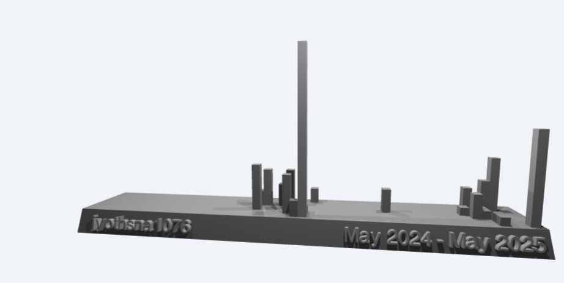

<h1 align="center">Hi 👋, I'm Jyothsna</h1>
<h3 align="center">A student passionate in learning new skills</h3>

  

  

- 🔭 I’m currently working on [ShroudX](https://github.com/saisriy/ShroudX)

- 🌱 I’m currently learning **DSA**

- 👨‍💻 All of my projects are available at [https://github.com/jyothsna1076](https://github.com/jyothsna1076)

- 💬 Ask me about **DSA, Machine Learning**

- 📫 How to reach me **www.linkedin.com/in/jyothsna-vadlamudi-11665b28b**

<h3 align="left">Connect with me:</h3>

<h3 align="left">Languages and Tools:</h3>

      

&nbsp;

